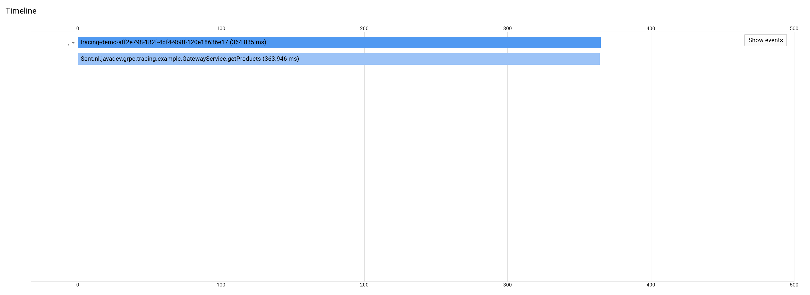

# grpc-distributed-tracing-example

This demo shows how to propagate a tracing span downstream over multiple [gRPC](https://grpc.io/) services
using [OpenCensus](https://opencensus.io/)
and making the trace visible in [Stackdriver](https://cloud.google.com/stackdriver/).

In this demo this is done for both synchronous and asynchronous services.
Where the asynchronous code is written by making use of [VAVR](http://www.vavr.io/).

---

## Explanation

The goal is to have tracing information starting from the client and include all downstream services.

### gRPC services in this demo

This is the relation between the made up services in this demo.


Their roles are:

#### Gateway service

The gateway service doesn't do anything other than passing on the request from the client to the product service
and returning the retrieved products to the client.
The reason for doing this is to show that a span is automatically propagated other services when calling these synchronously.

#### Product service

The product service is basically an orchestrator in this demo. In this demo it's the most complicated service.
It retrieves data from a database and enriches this data with data retrieved from other services (price- and stock services).
All of this is done asynchronously. Multiple products can be requested in one request, each product is retrieved and enriched in parallel.
The call to the database is simulated; simply adding some random latency.

#### Price service

The price service retrieves the price for a product from a legacy price information system.
It does this in a non-blocking manner using VAVR.
The call to this legacy pricing service is simulated; simply adding some random latency.

#### Stock level service

The Stock level service retrieves the stock level for a product from a legacy Warehousing system.
It does this in a blocking manner.
The call to this legacy warehouse service is simulated; simply adding some random latency.

---

### Starting a span from the client

#### Enabling exporting to stack driver

For the client we must configure that the OpenCensus tracing data is exported to Stackdriver.
More information about this exporter can be found [here](https://github.com/census-instrumentation/opencensus-java/tree/master/exporters/trace/stackdriver).

```java
public static void main(String[] args) throws Exception {
    StackdriverTraceExporter.createAndRegister(StackdriverTraceConfiguration.builder().build());
    
    ... ommitted ...
}
```
[RunClient](src/main/java/RunClient.java)

#### Starting and ending a sampling span

Before we call a gRPC service we need to start a sampling span.
By making this the active span it will be propagated to the service that is called next.
When done we close the span.

Finally we make the client wait 10 seconds to allow the stack driver exporter to upload the tracing data to Stackdriver.

```java
final var spanName = String.format("tracing-demo-%s", UUID.randomUUID());
final var makeSpanActive = true;
final var parentSpan = TracingUtil.startNewParentSamplingSpan(spanName, makeSpanActive);

// Call a service
final var request = GetProductsRequest.newBuilder()
        .addProductIds("1")
        .addProductIds("2")
        .addProductIds("3")
        .build();
final var response = gatewayServiceClient.getProducts(request);

parentSpan.end();

// Waiting 10 seconds to give the Stackdriver trace exporter a chance to upload the tracing information
Thread.sleep(10_000);
```
[RunClient](src/main/java/RunClient.java)

[TracingUtil](src/main/java/nl/javadev/grpc/tracing/util/TracingUtil.java)

#### Spans from the services are not shown (yet)

If we run the client, then we can see tracing information showing up in Stackdriver.
But it doesn't show any details of the services that are called.



What gives? ☹️

### Enabling exporting to stack driver per service

We must configure each service to also export its tracing information to Stackdriver.
Important here is to have the services export to the same Google Cloud project as the client is exporting to.
This will allow Stackdriver to combine the tracing information.

_When running this demo locally as described further down this will not be a problem._
_It's more something to keep in mind when tracing deployed services from a client running in an environment different than the one where the services are running._

```java
static void runServer(final ServerBuilder serverBuilder) throws Exception {
    // Start an exporter for every server instance
    StackdriverTraceExporter.createAndRegister(StackdriverTraceConfiguration.builder().build());
    
    ... ommitted ...
}
```
[AbstractServerRunner](src/main/java/AbstractServerRunner.java)

### Tracing synchronous code

The Gateway service simply does a blocking call to the Product service.
This is to demonstrate that in such a case the tracing span will be propagated to the next service automatically.
Exactly like it works in the client.

```java
@Override
public void getProducts(final GetProductsRequest request,
                        final StreamObserver<GetProductsResponse> responseObserver) {
    try {
        final var productServiceRequest = GetProductsWithPriceAndStockDetailsRequest.newBuilder()
                .addAllProductIds(request.getProductIdsList())
                .build();

        // Nothing special is being done. The client will continue the span, passing it to the product service
        final var productServiceResponse = productServiceClient
                .getProductsWithPriceAndStockDetails(productServiceRequest);
                
        ... ommitted ...
}
```
[GatewayService](src/main/java/nl/javadev/grpc/tracing/example/GatewayService.java)

### Tracing asynchronous code

For asynchronous code a bit more has to be done.

Taking the product service as an example;
it looks up a product data in the database and enriches this with price and stock information from other services.
Doing this all in an asynchronous way (using VAVR).

#### Capturing the span

This code demonstrates that we then explicitly have to capture the span before executing the asynchronous code.
The reason for doing this is that the asynchronous code is executed by a different thread than the gRPC thread
that calls the rpc method initially. A context that "knows" about the span is bound to the gRPC thread.
While the thread that executes the code asynchronously is not aware of any gRPC context.
And thus cannot retrieve the active span. 

```java
@Override
public void getProductsWithPriceAndStockDetails(final GetProductsWithPriceAndStockDetailsRequest request,
                                                final StreamObserver<GetProductsWithPriceAndStockDetailsResponse> responseObserver) {
    // Capture the span bound to the GRPC thread that calls this method.
    // It will not be available for the threads that execute the asynchronous steps.
    final var span = Tracing.getTracer().getCurrentSpan();

    // Passing on the span to a different method (createFutureForEachProduct).
    // This Future is executed by a different thread than the gRPC thread
    Future.sequence(createFutureForEachProduct(request.getProductIdsList(), span))
            .map(productsWithDetails ->
                    GetProductsWithPriceAndStockDetailsResponse.newBuilder()
                            .addAllProducts(productsWithDetails)
                            .build())
            .onSuccess(response -> {
                responseObserver.onNext(response);
                responseObserver.onCompleted();
            })
            .onFailure(responseObserver::onError);
}
```
[ProductService](src/main/java/nl/javadev/grpc/tracing/example/ProductService.java)

#### Passing on the span to an asynchronously called client

When another gRPC service is called from within asynchronously executed code then we need to somehow pass the earlier
captured span to this next service.
This is possible by setting it as the active span on the thread that executes the asynchronous code
making the call to next service.

```java
private Future<Double> getPriceForProduct(final String productId, final Span span) {
    // Explicitly set the span as the active span on the current thread
    // so the client call will pick it up and pass it on
    Tracing.getTracer().withSpan(span);

    final var priceForProductRequest = GetPriceForProductRequest.newBuilder()
            .setProductId(productId)
            .build();

    return Future
            .fromJavaFuture(priceServiceClient.getPriceForProduct(priceForProductRequest))
            .map(GetPriceForProductResponse::getPrice);
}
```
[ProductService](src/main/java/nl/javadev/grpc/tracing/example/ProductService.java)

#### Creating a child span within asynchronously executed code

It is possible to create a child span under the earlier captured span.
Such a child span can be used to add an extra "step" in the trace overview.
It is however important to always end that span as well!

This is demonstrated in the following code.

It's perhaps a bit hard to digest when you're not used to a more functional programming style.
But the important parts here are the creation of the child span based on the earlier captured span.
And the fact that this child span is closed at the end of the Future.

```java
private Future<ProductWithDetails> getProductAndDetails(final String productId, final Span span) {
    final var spanName = String.format("getProductAndDetails#%s", productId);
    return Future
            // Create a new child span, based on the initially captured span
            .successful(TracingUtil.createNewChildSpan(spanName, span))
            .flatMap(childSpan ->
                    // Start by retrieving the basic product data from the database (we pass on the child span)
                    getProductFromDatabase(productId, childSpan)
                            // Fail if the product could not be found in the database
                            .map(optionalProduct ->
                                    optionalProduct.getOrElseThrow(() ->
                                            new RuntimeException(String.format("Product %s not found in database", productId)))
                            )
                            // Create the ProductWithDetails, but without price and stock details filled in
                            .map(product ->
                                    ProductWithDetails.newBuilder()
                                            .setId(product.id)
                                            .setDescription(product.description)
                                            .build()
                            )
                            // Fill in the price and stock details asynchronously (we also here pass on the child span)
                            .flatMap(pwd -> enrichProductWithPriceAndStockDetails(pwd, childSpan))
                            // Close the child span at the end of this asynchronously executed Future
                            .onComplete(productWithDetails -> childSpan.end())
            );
}
```
[ProductService](src/main/java/nl/javadev/grpc/tracing/example/ProductService.java)

### Result

When the services are configured to export to Stackdriver as well
and the span is passed correctly throughout asynchronous code.
The we will see that, after running the client again, that the trace information from all down stream services 
is now included. 🎉

In this screenshot I've drawn colored boxes around the different steps in attempt to make it a bit easier
to quickly see the three products being retrieved and then enriched in parallel.


---

## How to run this demo

### Prerequisites:
- Java 11
- Maven
- Google Cloud credentials that allow to upload to Stackdriver (`roles/cloudtrace.agent`)

### Download the code
```bash
git clone git@github.com:rlindooren/grpc-distributed-tracing-example.git
```

### Build the code
```bash
mvn clean package
```

### Start the services

_Do this in separate terminals_
All services are started as an individual JVM process to prove that the trace is truly shared
between separately running services and not within the same JVM.

```bash
java -cp target/grpc-distributed-tracing-example-1.0-SNAPSHOT-jar-with-dependencies.jar RunProductServiceServer
```

```bash
java -cp target/grpc-distributed-tracing-example-1.0-SNAPSHOT-jar-with-dependencies.jar RunPriceServiceServer
```

```bash
java -cp target/grpc-distributed-tracing-example-1.0-SNAPSHOT-jar-with-dependencies.jar RunStockLevelServiceServer
```

```bash
java -cp target/grpc-distributed-tracing-example-1.0-SNAPSHOT-jar-with-dependencies.jar RunGatewayServiceServer
```

### Run the client

This will request some products, using a sampling span

```bash
java -cp target/grpc-distributed-tracing-example-1.0-SNAPSHOT-jar-with-dependencies.jar RunClient
```
